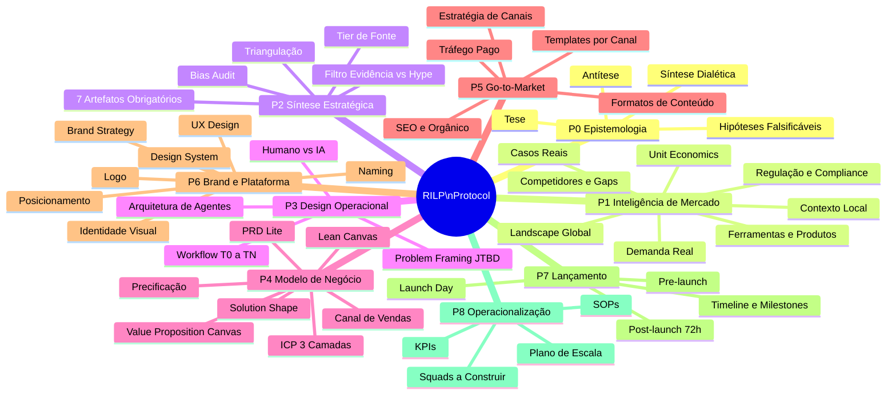
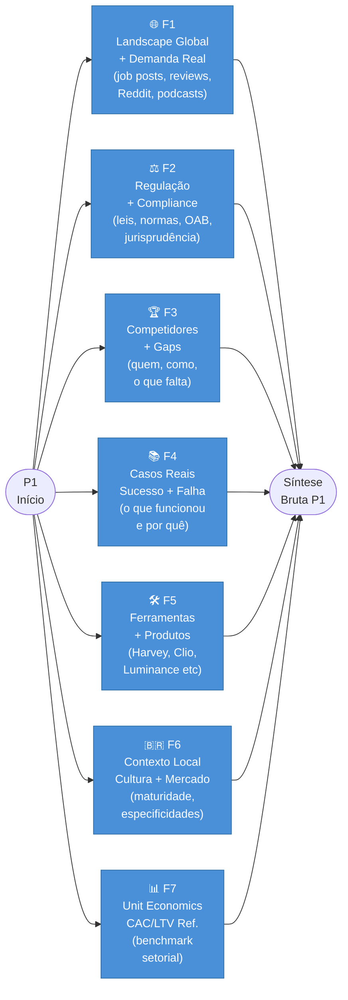
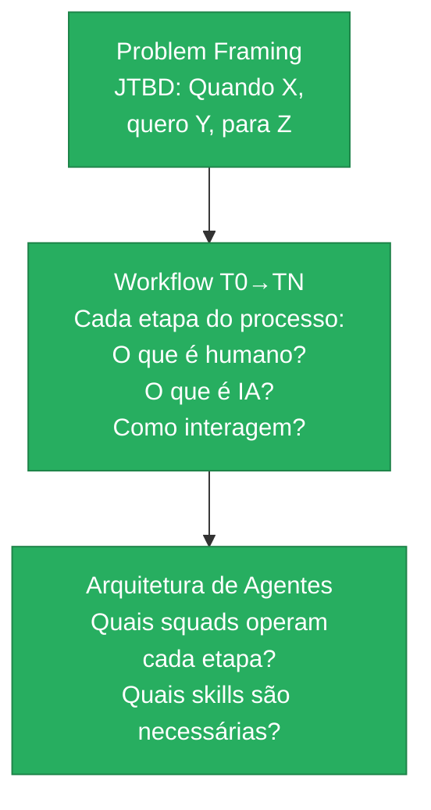
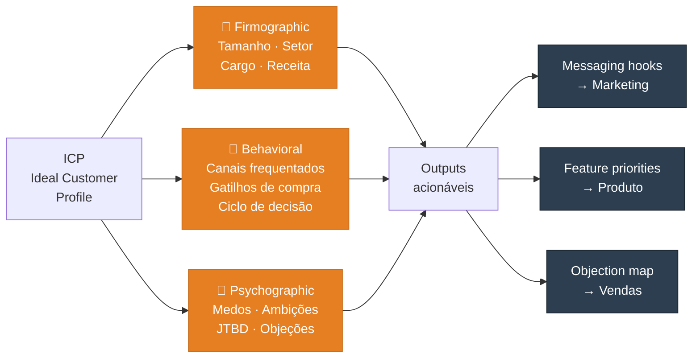

# RILP — Research Intelligence & Launch Protocol

> **Protocolo domain-agnostic de inteligência estratégica e lançamento de negócios**
> Da tese ao blueprint operacional completo — em qualquer domínio, para qualquer negócio.

**Versão:** 1.0.0-alpha | **Criado:** 2026-05-19 | **Run #1:** LegalTech

---

## ⚡ Em resumo

| | |
|---|---|
| **Começa em** | Escolha do domínio + formulação da tese |
| **Termina em** | Blueprint A-Z completo: workflow, agentes, brand, plataforma, plano de negócio — pronto para execução |
| **Tempo estimado** | 3–6 semanas (dependendo da profundidade de pesquisa) |
| **Pilares** | 8 pilares sequenciais com gates de qualidade entre cada um |
| **Domain-agnostic** | LegalTech · FinTech · HealthTech · Educação · Marketing · qualquer coisa |

---

## 🧠 Mapa Mental — Visão Completa



---

## 🗺️ Fluxo Principal A-Z

```mermaid
flowchart TD
    START(["🎯 START\nEscolha o Domínio"]):::startend --> P0

    subgraph PESQUISA["🔬  F A S E   D E   P E S Q U I S A"]
        direction TB
        P0["📐 PILAR 0 — EPISTEMOLOGIA\nTese  ·  Antítese  ·  Síntese Dialética\nHipóteses Falsificáveis"]:::epistemologia
        P1["🌍 PILAR 1 — INTELIGÊNCIA DE MERCADO\nLandscape · Regulatório · Competidores\nCasos · Ferramentas · Contexto · Unit Econ"]:::pesquisa
    end

    subgraph SINTESE["⚗️  S Í N T E S E"]
        P2["🧬 PILAR 2 — SÍNTESE ESTRATÉGICA\nFiltro Evidência vs Hype\n7 Artefatos Obrigatórios · Bias Audit"]:::sintese
    end

    subgraph DESIGN["🏗️  D E S I G N"]
        P3["🔧 PILAR 3 — DESIGN OPERACIONAL\nProblem Framing · Workflow T0→TN\nHumano vs IA · Arquitetura Agentes"]:::design
    end

    subgraph NEGOCIO["💼  N E G Ó C I O"]
        P4["💰 PILAR 4 — MODELO DE NEGÓCIO\nICP · VPC · Lean Canvas · PRD-Lite\nPrecificação · Canal de Vendas"]:::negocio
    end

    subgraph GTM["📣  G O - T O - M A R K E T"]
        P5["📢 PILAR 5 — GO-TO-MARKET\nCanais · Formatos de Conteúdo\nTemplates · SEO · Tráfego Pago"]:::gtm
    end

    subgraph BRAND["🎨  B R A N D   +   P L A T A F O R M A"]
        P6["🖌️ PILAR 6 — BRAND + PLATAFORMA\nBrand Identity · UX Design · Design System\nCores · Tipografia · Componentes"]:::brand
    end

    subgraph LAUNCH["🚀  L A N Ç A M E N T O"]
        P7["🛫 PILAR 7 — LANÇAMENTO\nTimeline · Milestones · Pre-launch\nLaunch Day · Monitoramento 72h"]:::launch
    end

    subgraph OPS["⚙️  O P E R A C I O N A L I Z A Ç Ã O"]
        P8["🤖 PILAR 8 — OPERACIONALIZAÇÃO\nSquads · SOPs · KPIs · Escala"]:::ops
    end

    P0 --> G01{"GATE\n0→1"}:::gate
    G01 -->|"✅ Hipóteses\nclaras"| P1
    G01 -->|"❌ Refinar"| P0

    P1 --> G12{"GATE\n1→2"}:::gate
    G12 -->|"✅ Dados\nsuficientes"| P2
    G12 -->|"❌ Mais\npesquisa"| P1

    P2 --> G23{"GATE\n2→3"}:::gate
    G23 -->|"✅ Síntese\nvalidada"| P3
    G23 -->|"❌ Revisar\nevidências"| P2

    P3 --> G34{"GATE\n3→4"}:::gate
    G34 -->|"✅ Workflow\naprovado"| P4
    G34 -->|"❌ Redesign\nnecessário"| P3

    P4 --> G45{"GATE\n4→5\nUnit Econ"}:::gate
    G45 -->|"✅ Números\nfecham"| P5
    G45 -->|"❌ Ajustar\nmodelo"| P4

    P5 --> G56{"GATE\n5→6\nICP Val."}:::gate
    G56 -->|"✅ ICP validado\n5+ entrevistas"| P6
    G56 -->|"❌ Revisitar\nGTM"| P5

    P6 --> G67{"GATE\n6→7"}:::gate
    G67 -->|"✅ Brand +\nPlataforma OK"| P7
    G67 -->|"❌ Refinamento\nnecessário"| P6

    P7 --> G78{"GATE\n7→8"}:::gate
    G78 -->|"✅ Launch\nbem-sucedido"| P8
    G78 -->|"❌ Ajustes\npré-ops"| P7

    P8 --> END(["✅ END\nBusiness Blueprint A-Z\nPronto para Execução"]):::startend

    classDef epistemologia fill:#6C63FF,stroke:#5A52D5,color:#fff,font-weight:bold
    classDef pesquisa fill:#4A90D9,stroke:#2E6DA4,color:#fff,font-weight:bold
    classDef sintese fill:#9B59B6,stroke:#8E44AD,color:#fff,font-weight:bold
    classDef design fill:#27AE60,stroke:#1E8449,color:#fff,font-weight:bold
    classDef negocio fill:#E67E22,stroke:#CA6F1E,color:#fff,font-weight:bold
    classDef gtm fill:#E74C3C,stroke:#C0392B,color:#fff,font-weight:bold
    classDef brand fill:#E91E8C,stroke:#C2185B,color:#fff,font-weight:bold
    classDef launch fill:#1ABC9C,stroke:#17A589,color:#fff,font-weight:bold
    classDef ops fill:#2C3E50,stroke:#1A252F,color:#fff,font-weight:bold
    classDef gate fill:#FFF9C4,stroke:#F9A825,color:#333,font-weight:bold
    classDef startend fill:#2ECC71,stroke:#27AE60,color:#fff,font-weight:bold
```



---

## 📋 Pilares em Detalhe

---

### 📐 PILAR 0 — Epistemologia
> *"Antes de pesquisar o mundo, defina o que você acredita — e o que contradiz isso."*

**Propósito:** Estabelecer a fundação intelectual. Evita pesquisa sem norte.

| Campo | Conteúdo |
|-------|---------|
| **Tese** | Qual é a hipótese central que defendemos sobre este domínio? |
| **Antítese** | O que contradiz? O que já foi tentado e falhou? Por quê? |
| **Síntese dialética** | O que emerge da tensão entre os dois? Onde está a oportunidade real? |
| **Hipóteses falsificáveis** | Lista de afirmações que a pesquisa deve confirmar ou refutar |
| **Output** | `p0-epistemologia/hypotheses.md` |
| **Agentes** | `@analyst` · `deep-research` (sackett, creswell) |

⛔ **GATE 0→1:** Hipóteses estão claras e são falsificáveis? → avança para P1

---

### 🌍 PILAR 1 — Inteligência de Mercado
> *"Sem dados reais, qualquer estratégia é ficção."*

**Propósito:** 7 camadas de pesquisa paralela — rodando simultaneamente.



| Campo | Conteúdo |
|-------|---------|
| **Metodologia** | Gilad CI + PRISMA-lite + Jobs-to-be-Done |
| **Tier 1 de fontes** | Peer-reviewed, reguladores, pesquisas independentes |
| **Tier 2 de fontes** | Analyst firms vendor-neutral, conferências setoriais |
| **Tier 3 de fontes** | Vendor blogs *(tag obrigatória: conflito de interesse)* |
| **Sinais de demanda** | Job posts, G2/Capterra, Reddit, HN, podcasts setoriais |
| **Output** | `p1-inteligencia/` — 7 arquivos temáticos |
| **Agentes** | `deep-research squad` (11 agentes) · `@analyst` · `legal-analyst squad` |

⛔ **GATE 1→2:** Dados suficientes nas 7 camadas? → avança para P2

---

### 🧬 PILAR 2 — Síntese Estratégica
> *"A diferença entre inteligência e ruído é o crivo."*

**Propósito:** Transformar massa de dados em 7 artefatos acionáveis.

**3 Filtros Obrigatórios:**

| Filtro | Como aplicar |
|--------|-------------|
| **Tier de fonte** | peer-reviewed > regulador > vendor-neutral > analyst pago > vendor blog |
| **Convergência triangulada** | Claim só avança se aparece em 3+ fontes independentes de tiers distintos |
| **Tag de conflito de interesse** | Explícita em toda citação de vendor ou consultoria paga |

**7 Artefatos de Saída — Todos obrigatórios:**

| # | Artefato | Formato | Alimenta |
|---|----------|---------|---------|
| 1 | Matriz JTBD (prioridade × evidência) | YAML | Produto, Marketing |
| 2 | ICP segmentado + mercado bottom-up | YAML | Negócio, GTM |
| 3 | Mapa competitivo + gaps exploráveis | YAML | Posicionamento |
| 4 | Heatmap regulatório (riscos × obrigações) | YAML | Jurídico, Produto |
| 5 | Benchmark unit economics setorial | YAML | Modelo de Negócio |
| 6 | Vocabulário do cliente (frases literais) | MD | Copy, Conteúdo |
| 7 | 10 hipóteses falsificáveis para o MVP | MD | Produto |

| Campo | Conteúdo |
|-------|---------|
| **Output** | `p2-sintese/` — 7 arquivos YAML + MD |
| **Agentes** | `@analyst` · `@qa` · `deep-research QA tier` (ioannidis + kahneman) |

⛔ **GATE 2→3:** Síntese auditada por ioannidis (evidência) + kahneman (bias)? → avança para P3

---

### 🔧 PILAR 3 — Design Operacional
> *"Antes de decidir o que construir, entenda como o negócio vai funcionar."*

**Propósito:** Traduzir pesquisa em operação real — passo a passo do negócio.



| Campo | Conteúdo |
|-------|---------|
| **Output** | `p3-design/workflow.md` · `p3-design/agent-architecture.yaml` |
| **Agentes** | `@architect` · `@ux-design-expert` · `@pm` |

⛔ **GATE 3→4:** Workflow revisado por 2+ especialistas do domínio? → avança para P4

---

### 💰 PILAR 4 — Modelo de Negócio
> *"Um modelo de negócio sem unit economics é um sonho, não um plano."*

**ICP em 3 camadas:**



**Sequência interna do Pilar 4:**

| Passo | Entregável |
|-------|-----------|
| 1 | ICP definido (3 camadas) |
| 2 | Value Proposition Canvas — pains/gains ↔ solução |
| 3 | Solution Shape — o "o quê" em alto nível (antes do design) |
| 4 | Lean Canvas — sumário visual 1 página |
| 5 | PRD-Lite — YAML/MD estruturado para agentes downstream |
| 6 | Modelo de precificação + canal de vendas |

| Campo | Conteúdo |
|-------|---------|
| **Output** | `p4-negocio/` — ICP, VPC, canvas, PRD-lite, pricing |
| **Agentes** | `@pm` · `@analyst` · `copy-chief` (messaging hooks) |

⛔ **GATE UNIT ECONOMICS:** CAC presumido / LTV / Payback fecham em pelo menos 1 cenário realista? **Não passa aqui sem os números fecharem.** → avança para P5

---

### 📢 PILAR 5 — Go-to-Market
> *"A mensagem certa, no canal certo, para a pessoa certa."*

**Propósito:** Definir como chegar ao ICP e converter.

| Elemento | Decisões |
|----------|---------|
| **Canais primários** | Onde o ICP vive? LinkedIn · YouTube · Instagram · Google · Comunidades |
| **Mix orgânico/pago** | Proporção de budget, timeline de retorno por canal |
| **Formatos de conteúdo** | Vídeo (roteiro + formato) · Posts (modelo + frequência) · Artigos · Newsletter |
| **Templates por canal** | Estrutura fixa: gancho → desenvolvimento → CTA |
| **SEO** | Clusters temáticos, conteúdo pilar, authority building |
| **Tráfego pago** | Canais, budget inicial, métricas de otimização, criativos |

| Campo | Conteúdo |
|-------|---------|
| **Output** | `p5-gtm/` — estratégia, templates de conteúdo, calendário editorial |
| **Agentes** | `traffic-masters-chief` · `copy-chief` · `story-chief` · `seo squad` · `curator` |

⛔ **GATE 5→6:** ICP validado com 5+ entrevistas reais (não suposições)? VP testada (smoke test, landing, pré-venda)? → avança para P6

---

### 🖌️ PILAR 6 — Brand + Plataforma
> *"A marca é o que as pessoas sentem. A plataforma é onde elas agem."*

**Brand — Sequência do Brand Squad:**


**Plataforma — Sequência Apex + Design System:**

| Fase | Entregável |
|------|-----------|
| UX Research | User journeys, pain points, information architecture |
| Wireframes | Low-fi → High-fi progressivo |
| Design System | Tokens (cores, tipografia, espaçamento) · Componentes · Guidelines |
| Especificação técnica | Handoff para desenvolvimento |

| Campo | Conteúdo |
|-------|---------|
| **Agentes Brand** | `brand squad` (Neumeier · Dunford · Johnson · Haviv · Watkins · Heyward) |
| **Agentes Plataforma** | `apex squad` · `design-chief` · `@ux-design-expert` · `brad-frost` · `nano-banana-generator` |
| **Output** | `p6-brand/` + `p6-plataforma/` |

⛔ **GATE 6→7:** Brand identity aprovada? Plataforma prototipada e validada com usuários? → avança para P7

---

### 🛫 PILAR 7 — Lançamento
> *"Um lançamento sem plano é um acidente organizado."*

| Fase | Ações |
|------|-------|
| **Pre-launch** | Lista de espera · early access · beta fechado · aquecimento de audiência |
| **Launch Day** | Sequência de publicações · canais simultâneos · media kit pronto |
| **Post-launch 72h** | Monitoramento ativo · plano de resposta a problemas · coleta de feedback |

| Campo | Conteúdo |
|-------|---------|
| **Output** | `p7-lancamento/launch-plan.md` |
| **Agentes** | `@pm` · `@devops` · `dispatch squad` |

⛔ **GATE 7→8:** Lançamento executado? Métricas iniciais coletadas? → avança para P8

---

### 🤖 PILAR 8 — Operacionalização
> *"O objetivo final: o negócio operando com supervisão humana mínima."*

| Elemento | Entregável |
|----------|-----------|
| **Squads a construir** | Spec de cada squad: agentes, responsabilidades, SLA |
| **SOPs** | Standard Operating Procedures para cada função operacional |
| **KPIs** | Métricas por pilar: aquisição, ativação, retenção, receita, referral |
| **Plano de escala** | Como crescer sem quebrar a operação |

| Campo | Conteúdo |
|-------|---------|
| **Output** | `p8-ops/` — squad-specs · SOPs · KPI dashboard · scaling-plan |
| **Agentes** | `squad-chief` · `@architect` · `sop-extractor` · `pedro-valerio` · `kaizen squad` |

✅ **FIM:** Business Blueprint A-Z completo e pronto para execução.

---

## 👥 Time Completo por Pilar

| Pilar | Squads (outros projetos) | Agentes (projeto) |
|-------|--------------------------|-------------------|
| P0 Epistemologia | `deep-research` (sackett, creswell) | `@analyst` |
| P1 Inteligência | `deep-research` (11 agentes) · `legal-analyst` | `@analyst` · `legal-chief` · `data-chief` |
| P2 Síntese | `deep-research` QA (ioannidis, kahneman) | `@qa` · `@analyst` |
| P3 Design Operacional | — | `@architect` · `@ux-design-expert` · `@pm` |
| P4 Modelo de Negócio | — | `@pm` · `@analyst` · `copy-chief` |
| P5 Go-to-Market | `seo squad` · `curator` · `dispatch` | `traffic-masters-chief` · `copy-chief` · `story-chief` |
| P6 Brand + Plataforma | `brand squad` (7 agentes) · `apex squad` | `design-chief` · `brad-frost` · `nano-banana-generator` |
| P7 Lançamento | `dispatch` | `@devops` · `@pm` |
| P8 Operacionalização | `kaizen` · `squad-creator-pro` | `squad-chief` · `sop-extractor` · `pedro-valerio` |

---

## 📁 Estrutura de Arquivos — Um Run Completo

```
runs/
└── run-001-legaltech/
    ├── MANIFEST.yaml                    ← Estado + checksums de cada pilar
    ├── domain-pack.yaml                 ← Configurações específicas do domínio
    │
    ├── p0-epistemologia/
    │   └── hypotheses.md                ← Tese · Antítese · Síntese · Hipóteses
    │
    ├── p1-inteligencia/
    │   ├── f1-landscape.md              ← Landscape global + demanda real
    │   ├── f2-regulatorio.md            ← Regulação + compliance
    │   ├── f3-competidores.md           ← Mapa competitivo
    │   ├── f4-casos.md                  ← Casos reais de sucesso + falha
    │   ├── f5-ferramentas.md            ← Ferramentas e produtos existentes
    │   ├── f6-contexto-local.md         ← Especificidades do mercado local
    │   └── f7-unit-economics.md         ← Benchmark CAC/LTV setorial
    │
    ├── p2-sintese/
    │   ├── jtbd-matrix.yaml             ← Artefato 1: Matriz JTBD
    │   ├── icp-segmentado.yaml          ← Artefato 2: ICP + mercado bottom-up
    │   ├── mapa-competitivo.yaml        ← Artefato 3: Gaps exploráveis
    │   ├── heatmap-regulatorio.yaml     ← Artefato 4: Riscos × obrigações
    │   ├── unit-economics-benchmark.yaml← Artefato 5: Benchmark setorial
    │   ├── vocabulario-cliente.md       ← Artefato 6: Frases literais do cliente
    │   └── hipoteses-mvp.md             ← Artefato 7: 10 hipóteses falsificáveis
    │
    ├── p3-design/
    │   ├── problem-framing.md           ← JTBD estruturado
    │   ├── workflow-t0-tn.md            ← Workflow humano × IA por etapa
    │   └── agent-architecture.yaml      ← Squads e agentes necessários
    │
    ├── p4-negocio/
    │   ├── icp.md                       ← ICP 3 camadas
    │   ├── vpc.md                       ← Value Proposition Canvas
    │   ├── lean-canvas.md               ← Canvas visual 1 página
    │   ├── prd-lite.yaml                ← PRD estruturado para agentes
    │   └── pricing.md                   ← Modelo de precificação + canal
    │
    ├── p5-gtm/
    │   ├── estrategia-canais.md         ← Mix orgânico/pago por canal
    │   ├── seo-strategy.md              ← Clusters, conteúdo pilar
    │   ├── paid-strategy.md             ← Tráfego pago, criativos, budget
    │   └── templates-conteudo/
    │       ├── template-post-linkedin.md
    │       ├── template-roteiro-video.md
    │       └── template-newsletter.md
    │
    ├── p6-brand/
    │   ├── brand-strategy.md            ← Diagnóstico + posicionamento
    │   ├── naming.md                    ← Nome + SMILE/SCRATCH validation
    │   ├── visual-identity.md           ← Cores, tipografia, tom
    │   └── brand-book.md                ← Guia completo de identidade
    │
    ├── p6-plataforma/
    │   ├── ux-spec.md                   ← Jornadas, IA, wireframes
    │   ├── design-system/               ← Tokens, componentes, guidelines
    │   └── architecture.md              ← Stack e arquitetura técnica
    │
    ├── p7-lancamento/
    │   └── launch-plan.md               ← Pre · D-Day · Post 72h
    │
    ├── p8-ops/
    │   ├── squad-specs/                 ← Spec de cada squad a construir
    │   ├── sops/                        ← SOPs por função operacional
    │   ├── kpis.md                      ← Métricas por pilar
    │   └── scaling-plan.md              ← Plano de crescimento
    │
    ├── gates/
    │   ├── gate-01-resultado.md         ← PASS/FAIL + justificativa
    │   ├── gate-02-resultado.md
    │   └── ...
    │
    ├── handoffs/
    │   ├── handoff-p0-p1.yaml           ← Contexto transferido entre pilares
    │   ├── handoff-p1-p2.yaml
    │   └── ...
    │
    └── decisions/
        ├── ADR-001.md                   ← Decisões arquiteturais imutáveis
        └── ADR-002.md
```

---

## 🚀 Como Começar — Run #1 (LegalTech)

```mermaid
flowchart LR
    S1["1️⃣ Criar estrutura\nde pastas\nrun-001-legaltech/"]:::step --> S2
    S2["2️⃣ Ativar\n@analyst\nFormular tese"]:::step --> S3
    S3["3️⃣ deep-research\nP0: Epistemologia\n(sackett + creswell)"]:::step --> S4
    S4["4️⃣ P1: Pesquisa\n7 camadas\nem paralelo"]:::step --> S5
    S5["5️⃣ Gate 1→2\nSíntese +\nbias audit"]:::step --> S6
    S6["6️⃣ 7 Artefatos\ngerados\n(YAML + MD)"]:::step --> S7
    S7["7️⃣ ... seguir\nprotocolo\naté P8"]:::step --> S8
    S8["✅ Blueprint\nA-Z\npronto"]:::end

    classDef step fill:#4A90D9,stroke:#2E6DA4,color:#fff,font-weight:bold
    classDef end fill:#2ECC71,stroke:#27AE60,color:#fff,font-weight:bold
```

**Próximo passo imediato:**
> Confirmar que estamos alinhados neste protocolo → criar a estrutura de pastas → iniciar P0 com `@analyst`.

---

## ⚠️ Aviso de Aria (@architect)

> *"Não sobre-engenheire o core genérico antes de validar com 2 domínios reais. Faça LegalTech primeiro end-to-end, depois extraia o que é domain-agnostic. Generalizar com N=1 mata o protocolo."*

O LegalTech é o **Run #1**. Após completá-lo, um segundo domínio (sugestão: FinTech ou Educação) revela o que é verdadeiramente genérico vs. o que é específico do domínio jurídico. O `core/` e `domain-packs/` só se consolidam depois.

---

## 📊 Gates Consolidados

| Gate | De → Para | Critérios de Aprovação | Veredicto |
|------|-----------|------------------------|---------|
| G0→1 | Epistemologia → Pesquisa | Hipóteses claras e falsificáveis | PASS / FAIL |
| G1→2 | Pesquisa → Síntese | Dados suficientes nas 7 camadas | PASS / FAIL |
| G2→3 | Síntese → Design | Síntese auditada (evidência + bias) | PASS / CONCERNS / FAIL |
| G3→4 | Design → Negócio | Workflow validado por especialistas | PASS / FAIL |
| G4→5 | Negócio → GTM | Unit economics fecham em 1+ cenário | PASS / FAIL |
| G5→6 | GTM → Brand/Plataforma | ICP validado com 5+ entrevistas reais | PASS / FAIL |
| G6→7 | Brand → Lançamento | Brand + plataforma aprovados | PASS / FAIL |
| G7→8 | Lançamento → Ops | Launch executado, métricas coletadas | PASS / FAIL |

---

*RILP v1.0.0-alpha — Research Intelligence & Launch Protocol*
*Criado: 2026-05-19*
*Autores: Orion (aiox-master) · Alex (@analyst) · Morgan (@pm) · Aria (@architect)*
*Run #1: LegalTech — Mercado Jurídico Brasileiro*
