# RILP v2.0 — Research Intelligence & Launch Protocol

> **Sistema de inteligência estratégica e lançamento de negócios, operado por IA**
> Do zero ao negócio rodando — em qualquer domínio, com qualidade de firma de consultoria de primeiro nível.

**Versão:** 2.0.0 | **Criado:** 2026-05-19 | **Revisado:** 2026-06-26
**Run #1:** LegalTech — Mercado Jurídico Brasileiro

---

## ⚡ O que é o RILP

O RILP não é uma metodologia de pesquisa. É uma **fábrica de negócios operada por IA**.

Você entra com um domínio e uma tese. Sai com pesquisa de mercado de nível institucional, modelo de negócio validado, brand identity completa, plataforma especificada, estratégia GTM com templates prontos, negócio lançado e squads de IA operando com SOPs e KPIs.

**Tempo:** 3–6 semanas de execução ativa.
**Custo:** tokens — não consultores sênior.

### O problema que o RILP resolve

Lançar um negócio com qualidade institucional custa hoje:

| Entregável | Custo tradicional |
|---|---|
| Pesquisa de mercado profunda | R$ 150–500K |
| Estratégia de negócio | R$ 100–300K |
| Brand identity completa | R$ 80–250K |
| UX/UI + Design System | R$ 100–400K |
| GTM strategy | R$ 60–200K |
| **Total** | **R$ 490K – R$ 1,65M** |

Isso é inacessível para a maioria dos fundadores. O RILP colapsa esse custo para semanas e tokens — **democratizando acesso a inteligência estratégica de primeiro nível**.

### Os especialistas que operam o sistema

O RILP não usa "IA gerando texto". Cada fase é operada por clones de especialistas reais:

| Especialista | Área de atuação | Pilar |
|---|---|---|
| **Sackett + Creswell** | Metodologia científica | P0 — epistemologia |
| **Gilad** | Competitive Intelligence | P1 — pesquisa de mercado |
| **Ioannidis** | Auditoria de evidência científica | P2 — síntese estratégica |
| **Kahneman** | Viés cognitivo e decisão | P2 — bias audit |
| **Neumeier + Dunford** | Brand strategy e posicionamento | P6 — brand |
| **Haviv + Watkins + Heyward** | Naming e identidade visual | P6 — brand |
| **Brad Frost** | Design system atômico | P6 — plataforma |
| **pedro-valerio** | Validação de processos sem falhas | P8 — operacionalização |

---

## 🏗️ As 3 Camadas do RILP

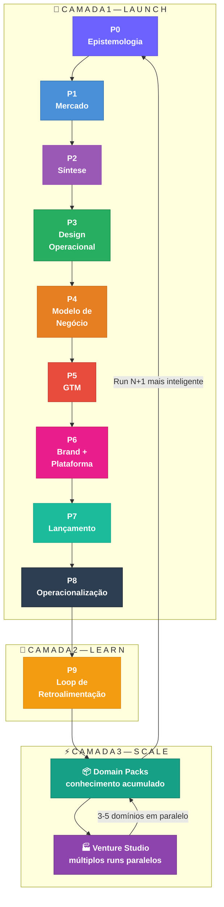

**Camada 1 — Launch:** Transforma domínio + tese em negócio lançado. Os 9 pilares sequenciais com gates obrigatórios.

**Camada 2 — Learn:** O que o mercado real ensina retroalimenta o sistema. Hipóteses confirmadas ou refutadas, artefatos atualizados, domain pack enriquecido.

**Camada 3 — Scale:** Knowledge base acumulada vira ativo comercializável. Múltiplos runs em paralelo funcionam como venture studio operado por IA.

---

## 🗺️ Fluxo Principal A-Z — Expandido

```mermaid
flowchart TD
    START(["🎯 START\nEscolha o Domínio\n+ Tese Inicial"]):::startend

    subgraph PESQUISA["🔬  F A S E   D E   P E S Q U I S A"]
        P0["📐 P0 — EPISTEMOLOGIA\nTese · Antítese · Síntese Dialética\nHipóteses Falsificáveis Numeradas"]:::ep
        P1["🌍 P1 — INTELIGÊNCIA DE MERCADO\n7 camadas paralelas\nLandscape · Reg. · Competidores · Casos · Tools · Local · Unit Econ"]:::pesq
    end

    subgraph SINTESE["⚗️  S Í N T E S E"]
        P2["🧬 P2 — SÍNTESE ESTRATÉGICA\nFiltro Tier · Triangulação · Bias Audit\n7 Artefatos com Score de Confiança"]:::sint
    end

    subgraph DESIGN["🏗️  D E S I G N"]
        P3["🔧 P3 — DESIGN OPERACIONAL\nProblem Framing JTBD\nWorkflow T0→TN · Arquitetura de Agentes"]:::des
    end

    subgraph NEGOCIO["💼  N E G Ó C I O"]
        P4["💰 P4 — MODELO DE NEGÓCIO\nICP 3 camadas · VPC · Lean Canvas\nPRD-Lite · Precificação · Canal"]:::neg
    end

    subgraph GTM["📣  G O - T O - M A R K E T"]
        P5["📢 P5 — GO-TO-MARKET\nCanais · Conteúdo · Templates\nSEO · Tráfego Pago"]:::gtm
    end

    subgraph BRAND["🎨  B R A N D   +   P L A T A F O R M A"]
        P6["🖌️ P6 — BRAND + PLATAFORMA\nIdentidade · Naming · Visual · UX\nDesign System · Arquitetura Técnica"]:::brand
    end

    subgraph LAUNCH2["🚀  L A N Ç A M E N T O"]
        P7["🛫 P7 — LANÇAMENTO\nPré-launch · Launch Day · 72h"]:::launch
    end

    subgraph OPS["⚙️  O P E R A C I O N A L I Z A Ç Ã O"]
        P8["🤖 P8 — OPERACIONALIZAÇÃO\nSquads · SOPs · KPIs · Plano de Escala"]:::ops
    end

    subgraph FEEDBACK["🔄  A P R E N D I Z A D O"]
        P9["🔁 P9 — LOOP DE RETROALIMENTAÇÃO\nDados Reais · Hipóteses vs Resultado\nAtualização do Domain Pack"]:::loop
    end

    START --> P0
    P0 --> G01{"GATE\n0→1"}:::gate
    G01 -->|"✅ Hipóteses\nfalsificáveis"| P1
    G01 -->|"❌ Refinar"| P0

    P1 --> G12{"GATE\n1→2"}:::gate
    G12 -->|"✅ 7 camadas\ncompletas"| P2
    G12 -->|"❌ Lacunas\ncríticas"| P1

    P2 --> G23{"GATE\n2→3\nScore ≥ 70%"}:::gate
    G23 -->|"✅ Auditado\n+ score OK"| P3
    G23 -->|"❌ Evidência\ninsuficiente"| P2

    P3 --> G34{"GATE\n3→4"}:::gate
    G34 -->|"✅ Workflow\nvalidado"| P4
    G34 -->|"❌ Redesign"| P3

    P4 --> G45{"GATE\n4→5\nUnit Econ"}:::gate
    G45 -->|"✅ Números\nfecham"| P5
    G45 -->|"❌ Modelo\nnão viável"| P4

    P5 --> G56{"GATE\n5→6\n5+ entrevistas"}:::gate
    G56 -->|"✅ ICP\nvalidado"| P6
    G56 -->|"❌ Revisitar\nGTM"| P5

    P6 --> G67{"GATE\n6→7"}:::gate
    G67 -->|"✅ Brand +\nPlataforma OK"| P7
    G67 -->|"❌ Refinamento"| P6

    P7 --> G78{"GATE\n7→8"}:::gate
    G78 -->|"✅ Launch\nexecutado"| P8
    G78 -->|"❌ Ajustes"| P7

    P8 --> G89{"GATE\n8→9"}:::gate
    G89 -->|"✅ Squads\noperando"| P9
    G89 -->|"❌ SOPs\nincompletos"| P8

    P9 --> END(["✅ BUSINESS BLUEPRINT\nA-Z Completo\nSistema Aprendendo"]):::startend

    classDef ep fill:#6C63FF,stroke:#5A52D5,color:#fff,font-weight:bold
    classDef pesq fill:#4A90D9,stroke:#2E6DA4,color:#fff,font-weight:bold
    classDef sint fill:#9B59B6,stroke:#8E44AD,color:#fff,font-weight:bold
    classDef des fill:#27AE60,stroke:#1E8449,color:#fff,font-weight:bold
    classDef neg fill:#E67E22,stroke:#CA6F1E,color:#fff,font-weight:bold
    classDef gtm fill:#E74C3C,stroke:#C0392B,color:#fff,font-weight:bold
    classDef brand fill:#E91E8C,stroke:#C2185B,color:#fff,font-weight:bold
    classDef launch fill:#1ABC9C,stroke:#17A589,color:#fff,font-weight:bold
    classDef ops fill:#2C3E50,stroke:#1A252F,color:#fff,font-weight:bold
    classDef loop fill:#F39C12,stroke:#D68910,color:#fff,font-weight:bold
    classDef gate fill:#FFF9C4,stroke:#F9A825,color:#333,font-weight:bold
    classDef startend fill:#2ECC71,stroke:#27AE60,color:#fff,font-weight:bold
```

---

## 📋 Pilares em Detalhe

---

### 📐 P0 — Epistemologia
> *"Antes de pesquisar o mundo, defina o que você acredita — e o que poderia destruir essa crença."*

**Propósito:** Estabelecer a fundação intelectual do run. Evita pesquisa sem norte e garante que cada dado coletado confirme ou refute algo específico.

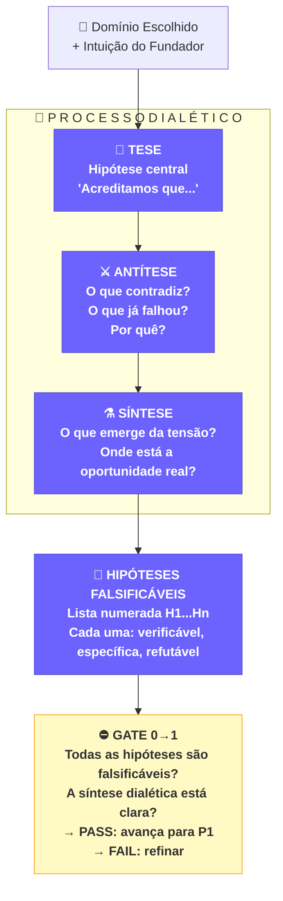

| Campo | Detalhe |
|---|---|
| **Agentes** | `@analyst` (Sackett + Creswell) · `deep-research` |
| **Output** | `p0-epistemologia/hypotheses.md` — tese, antítese, síntese, H1..Hn |
| **Tempo estimado** | 4–8h |
| **Modelo recomendado** | Opus/high — raciocínio epistêmico pesado |

⛔ **GATE 0→1:** Hipóteses estão claras, específicas e falsificáveis? A síntese dialética está articulada? → PASS/FAIL

---

### 🌍 P1 — Inteligência de Mercado
> *"Sem dados reais, qualquer estratégia é ficção bem escrita."*

**Propósito:** 7 camadas de pesquisa rodando em paralelo — cobrindo todas as dimensões do mercado simultaneamente.

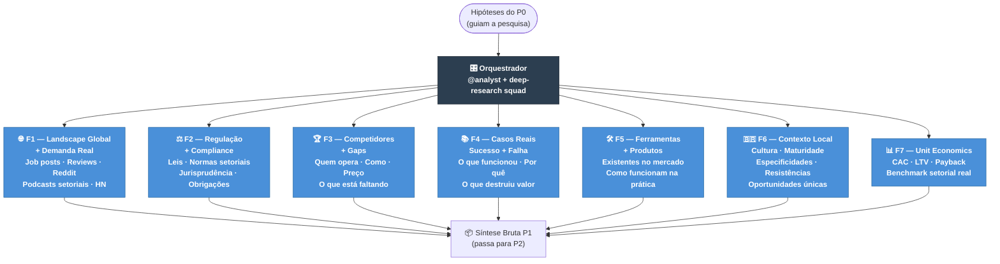

| Campo | Detalhe |
|---|---|
| **Metodologia** | Gilad CI + PRISMA-lite + Jobs-to-be-Done |
| **Fontes Tier 1** | Peer-reviewed, reguladores, pesquisas independentes |
| **Fontes Tier 2** | Analyst firms vendor-neutral, conferências setoriais |
| **Fontes Tier 3** | Vendor blogs *(tag obrigatória: conflito de interesse)* |
| **Agentes** | `deep-research squad` (11 agentes) · `@analyst` · `legal-analyst squad` (F2) |
| **Skills** | `tech-search` · `deep-research` · `Jurisprudências AI MCP` (F2) |
| **Output** | `p1-inteligencia/` — 7 arquivos `f1.md` a `f7.md` |
| **Tempo estimado** | 8–16h (paralelo) |
| **Modelo recomendado** | Haiku/low para coleta · Sonnet/medium para síntese por camada |

⛔ **GATE 1→2:** As 7 camadas têm cobertura suficiente? Nenhuma hipótese do P0 ficou sem dados? → PASS/FAIL

---

### 🧬 P2 — Síntese Estratégica
> *"A diferença entre inteligência e ruído é o crivo — e a coragem de descartar."*

**Propósito:** Transformar a massa de dados brutos em 7 artefatos acionáveis, com score de confiança por claim.

```mermaid
flowchart TD
    RAW["📦 Dados Brutos P1\n(7 camadas)"] --> TIER

    subgraph FILTROS["🔬  3   F I L T R O S   O B R I G A T Ó R I O S"]
        TIER["🏆 Filtro Tier de Fonte\nPeer-reviewed > Regulador > Vendor-neutral > Vendor-blog\nTag explícita de conflito de interesse"]
        TRIANG["△ Triangulação\nClaim só avança se aparece em\n3+ fontes independentes de tiers distintos"]
        BIAS["🧠 Bias Audit\nIoannidis: valida evidência\nKahneman: detecta viés cognitivo"]
        TIER --> TRIANG --> BIAS
    end

    BIAS --> SCORE["📊 Score de Confiança por Claim\nAlto: 3+ fontes Tier 1+2 trianguladas\nMédio: 2 fontes ou 1 Tier 1\nBaixo: 1 fonte Tier 3 ou não triangulado"]

    SCORE --> ARTEFATOS

    subgraph ARTEFATOS["📋  7   A R T E F A T O S   O B R I G A T Ó R I O S"]
        A1["① Matriz JTBD\nprioridade × evidência"]
        A2["② ICP Segmentado\n+ mercado bottom-up"]
        A3["③ Mapa Competitivo\n+ gaps exploráveis"]
        A4["④ Heatmap Regulatório\nriscos × obrigações"]
        A5["⑤ Benchmark Unit Economics\nCAC/LTV setorial real"]
        A6["⑥ Vocabulário do Cliente\nfrases literais (não suposições)"]
        A7["⑦ 10 Hipóteses Falsificáveis\npara o MVP"]
    end

    ARTEFATOS --> GATE["⛔ GATE 2→3\nScore médio ≥ 70%?\nBias audit aprovado?\nOs 7 artefatos gerados?"]

    classDef filtro fill:#9B59B6,stroke:#8E44AD,color:#fff,font-weight:bold
    classDef art fill:#6C63FF,stroke:#5A52D5,color:#fff,font-weight:bold
    classDef gate fill:#FFF9C4,stroke:#F9A825,color:#333,font-weight:bold
    class TIER,TRIANG,BIAS filtro
    class A1,A2,A3,A4,A5,A6,A7 art
    class GATE gate
```

### Score de Confiança — Tabela de Referência

| Score | Critério | Implicação no gate |
|---|---|---|
| 🟢 **Alto (80-100%)** | 3+ fontes Tier 1+2, trianguladas, sem conflito de interesse | Pode fundamentar decisão estratégica |
| 🟡 **Médio (50-79%)** | 2 fontes OU 1 Tier 1 não triangulada | Pode usar com ressalva explícita |
| 🔴 **Baixo (0-49%)** | 1 fonte Tier 3 OU não triangulada | Requer mais pesquisa antes de avançar |

### Fórmula de Agregação — bucket → % (do gate 2→3)

Os buckets são bandas qualitativas; o gate 2→3 exige um número. A conversão é **semi-determinística e calculável à mão**:

**Passo 1 — pontos-âncora por claim** (ponto médio-alto de cada banda):

| Bucket | Pontos-âncora |
|---|:---:|
| 🟢 Alto | 90 |
| 🟡 Médio | 65 |
| 🔴 Baixo | 25 |

**Passo 2 — peso por criticidade do claim para a tese:** decisório = 3 · relevante = 2 · contextual = 1 (default = 1 → média simples).

**Passo 3 — Score do run (%) = Σ(pontos × peso) ÷ Σ(peso)** — média ponderada dos claims.

**Exemplo (à mão):** 6 claims peso 1 — 3 Alto, 2 Médio, 1 Baixo → (3×90 + 2×65 + 1×25) ÷ 6 = 425 ÷ 6 = **70,8%** → passa o piso.

**Gate 2→3 (BLOQUEADOR) passa se:** Score do run ≥ 70% **E** nenhum claim **decisório** em bucket Baixo. Um claim decisório em Baixo reprova o gate mesmo com a média acima de 70% — é o mecanismo que impede "score baixo aceito contamina tudo".

| Campo | Detalhe |
|---|---|
| **Agentes** | `@analyst` · `@qa` · `deep-research QA tier` (ioannidis + kahneman) |
| **Output** | `p2-sintese/` — 7 YAMLs/MDs com score por claim |
| **Tempo estimado** | 4–8h |
| **Modelo recomendado** | Sonnet/medium para síntese · Opus/high para bias audit |

⛔ **GATE 2→3:** Score médio ≥ 70%? Ioannidis + kahneman aprovaram? → PASS / CONCERNS / FAIL

---

### 🔧 P3 — Design Operacional
> *"Antes de decidir o que construir, entenda exatamente como o negócio vai funcionar."*

**Propósito:** Traduzir pesquisa em operação real — mapeando cada etapa do processo, quem é humano e quem é IA.

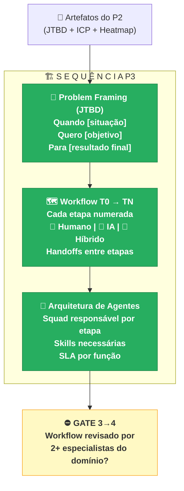

**Exemplo de Workflow T0→TN para LegalTech:**

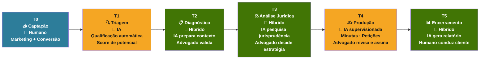

| Campo | Detalhe |
|---|---|
| **Agentes** | `@architect` · `@ux-design-expert` · `@pm` |
| **Output** | `p3-design/problem-framing.md` · `workflow-t0-tn.md` · `agent-architecture.yaml` |
| **Tempo estimado** | 4–6h |
| **Modelo recomendado** | Sonnet/medium |

⛔ **GATE 3→4:** Workflow validado por 2+ especialistas do domínio? Papéis humano/IA estão claros? → PASS/FAIL

---

### 💰 P4 — Modelo de Negócio
> *"Um modelo sem unit economics é um sonho. Com números que não fecham, é uma armadilha."*

**Propósito:** Definir se o negócio é viável economicamente — e exatamente como ele gera dinheiro.

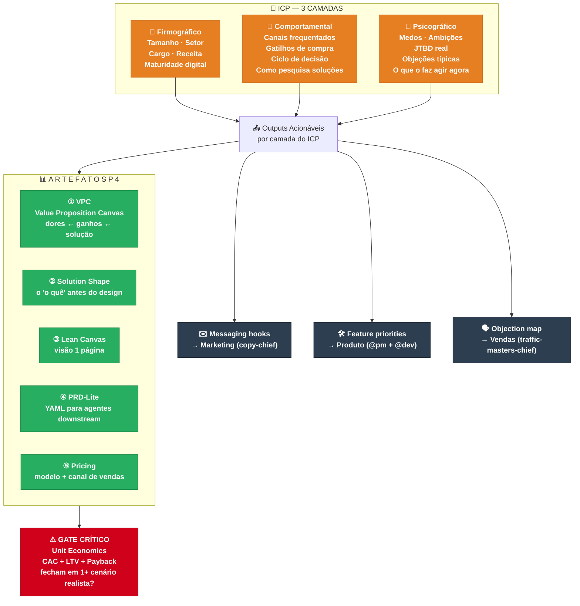

| Campo | Detalhe |
|---|---|
| **Agentes** | `@pm` · `@analyst` · `copy-chief` (messaging) |
| **Output** | `p4-negocio/` — ICP, VPC, lean-canvas, PRD-lite, pricing |
| **Tempo estimado** | 6–10h |
| **Modelo recomendado** | Sonnet/medium |

⛔ **GATE UNIT ECONOMICS (BLOQUEADOR):** CAC presumido / LTV / Payback fecham em pelo menos 1 cenário realista? **Não passa sem os números fecharem.** → PASS/FAIL

---

### 📢 P5 — Go-to-Market
> *"A mensagem certa, no canal certo, para a pessoa certa — no momento exato."*

**Propósito:** Definir como chegar ao ICP, converter e crescer.

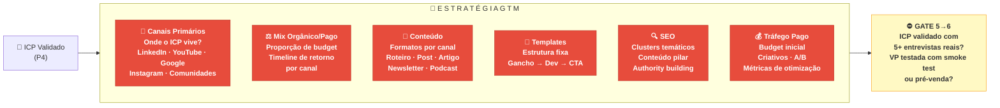

| Campo | Detalhe |
|---|---|
| **Agentes** | `traffic-masters-chief` · `copy-chief` · `story-chief` · `seo squad` · `curator` · `dispatch` |
| **Output** | `p5-gtm/` — estratégia, templates por canal, SEO strategy, paid strategy |
| **Tempo estimado** | 6–10h |
| **Modelo recomendado** | Sonnet/medium |

⛔ **GATE 5→6:** ICP validado com 5+ entrevistas reais (não suposições)? Value proposition testada? → PASS/FAIL

---

### 🖌️ P6 — Brand + Plataforma
> *"A marca é o que as pessoas sentem. A plataforma é onde elas agem."*

**Propósito:** Construir a identidade da marca e a plataforma onde o cliente interage — do posicionamento ao design system.

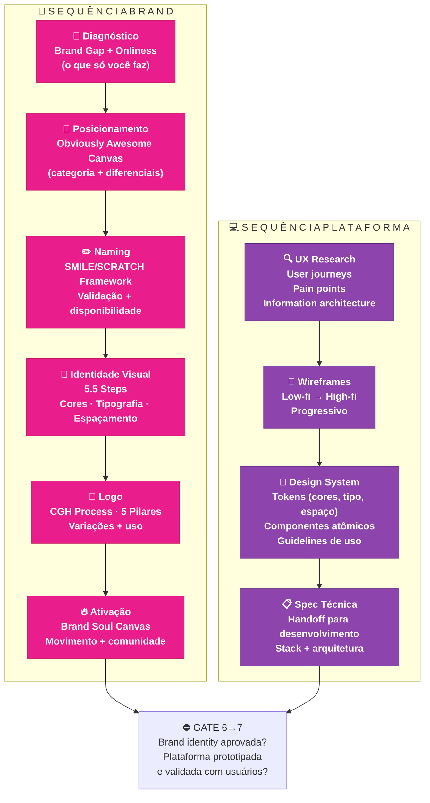

| Campo | Detalhe |
|---|---|
| **Agentes Brand** | `brand squad` — Neumeier · Dunford · Johnson · Haviv · Watkins · Heyward |
| **Agentes Plataforma** | `apex squad` · `design-chief` · `@ux-design-expert` · `brad-frost` · `nano-banana-generator` |
| **Output** | `p6-brand/` — brand book, naming, visual · `p6-plataforma/` — UX spec, design system, arquitetura |
| **Tempo estimado** | 10–20h |
| **Modelo recomendado** | Sonnet/medium para execução · Opus/high para decisões de posicionamento |

⛔ **GATE 6→7:** Brand identity aprovada? Plataforma prototipada e validada com usuários? → PASS/FAIL

---

### 🛫 P7 — Lançamento
> *"Um lançamento sem plano é um acidente organizado. Com plano, é um evento."*

**Propósito:** Executar o lançamento com timing preciso, canais coordenados e plano de resposta pronto.

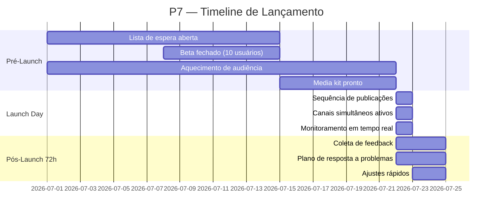

| Campo | Detalhe |
|---|---|
| **Agentes** | `@pm` · `@devops` · `dispatch squad` |
| **Output** | `p7-lancamento/launch-plan.md` — pré, day, 72h |
| **Tempo estimado** | 2–4h (plano) + execução real |
| **Modelo recomendado** | Sonnet/medium |

⛔ **GATE 7→8:** Lançamento executado? Métricas iniciais coletadas? → PASS/FAIL

---

### 🤖 P8 — Operacionalização
> *"O objetivo final: o negócio operando com supervisão humana mínima e escalando com inteligência."*

**Propósito:** Transição do lançamento para operação sustentável — squads de IA com SOPs, KPIs e plano de escala.

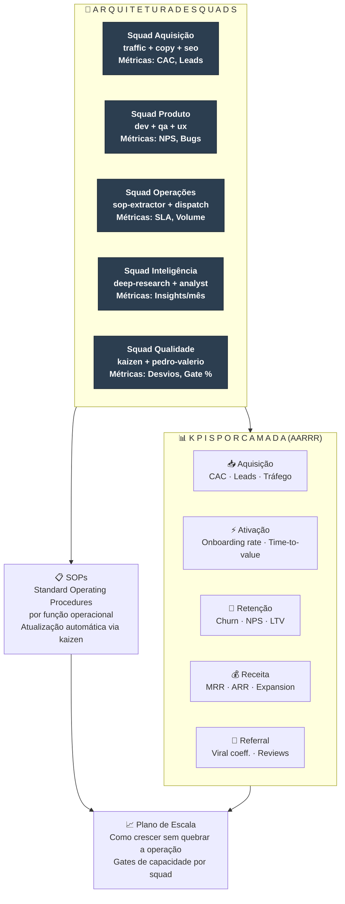

| Campo | Detalhe |
|---|---|
| **Agentes** | `squad-chief` · `@architect` · `sop-extractor` · `pedro-valerio` · `kaizen squad` |
| **Output** | `p8-ops/` — squad-specs, SOPs, kpis.md, scaling-plan.md |
| **Tempo estimado** | 6–10h |
| **Modelo recomendado** | Sonnet/medium para SOPs · Opus/high para arquitetura de squads |

⛔ **GATE 8→9:** Squads especificados? SOPs documentados? KPIs definidos e mensuráveis? → PASS/FAIL

---

### 🔁 P9 — Loop de Retroalimentação *(NOVO em v2.0)*
> *"O sistema aprende. Cada run torna o próximo mais preciso, mais rápido, mais barato."*

**Propósito:** Fechar o loop entre o que foi planejado (hipóteses do P0) e o que o mercado real confirmou ou refutou. Retroalimenta o domain pack e torna o próximo run mais inteligente.

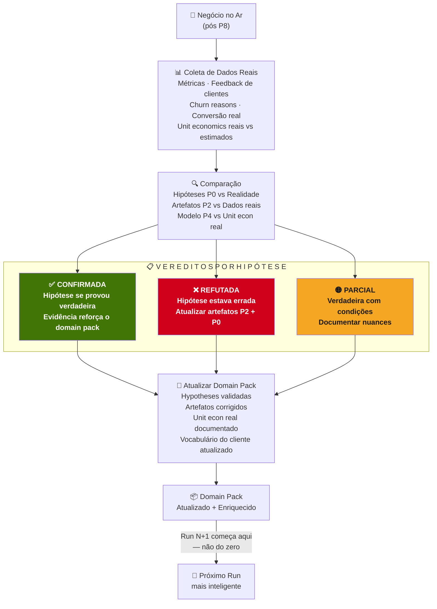

| Campo | Detalhe |
|---|---|
| **Quando ativar** | 30, 60 e 90 dias após o lançamento (P7) |
| **Agentes** | `@analyst` · `data-chief` · `kaizen squad` |
| **Output** | `p9-loop/retroalimentacao.md` · **domain pack PARCIAL do domínio** (`legaltech-v1.yaml`, uso interno; vendável só após ≥2 runs — ver Domain Packs) |
| **Modelo recomendado** | Sonnet/medium |

**O P9 não é encerramento — é recomeço mais inteligente.**

---

## 📦 Domain Packs — O Conhecimento como Produto

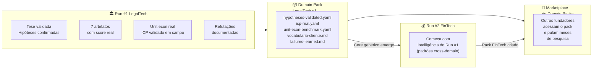

**Um domain pack contém:**
- Hipóteses validadas (o que o mercado confirmou)
- ICP real (não teórico — testado com clientes)
- Unit economics reais do setor
- Vocabulário do cliente (frases literais coletadas)
- Erros documentados (o que não funcionou e por quê)
- Heatmap regulatório atualizado
- Stack de ferramentas validada

**Consolidação em dois estágios:**
- **Pack PARCIAL (após 1 run):** gerado ao fim do P9 do próprio run (`legaltech-v1.yaml`) — dados reais de 1 domínio, uso interno/P&D. Serve para o Run N+1 do MESMO domínio começar mais fundo.
- **Pack VENDÁVEL / core cross-domain (após ≥2 runs):** só se consolida quando ≥2 domínios rodaram completos e o padrão cross-domain emerge. Generalizar com n=1 mata o protocolo (Aria, Princípio 5). Marketplace e Venture Studio partem daqui.

**Valor comercial:** Um empreendedor comprando o domain pack de LegalTech pula 6-8 semanas de pesquisa. O pack representa o P0+P1+P2 já executados com dados reais — não teóricos.

---

## 🏭 Venture Studio Mode — Múltiplos Runs em Paralelo

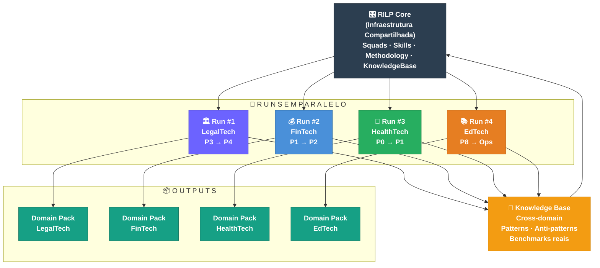

**Quando ativar o Venture Studio Mode:**
- Após Run #1 completar P9 (loop validado)
- Quando a infraestrutura de squads estiver rodando sem atrito
- Com file-ownership independente por run (worktrees separados)

**Regra de ouro:** Nunca iniciar Run #N+1 antes do Run #N ter completado pelo menos P2. Começar raso em muitos domínios é pior que ir fundo em um.

---

## 👥 Time Completo — Organograma por Pilar

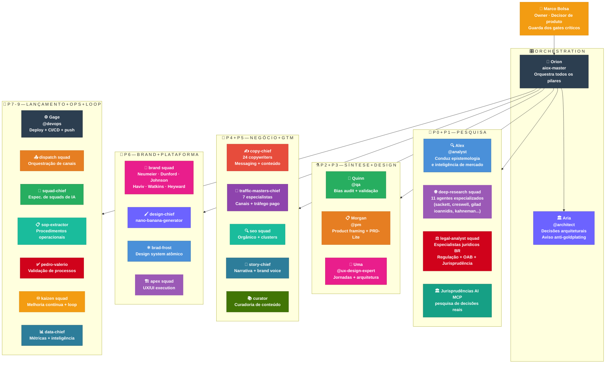

---

## 📁 Estrutura de Arquivos — Um Run Completo

```
runs/
└── run-001-legaltech/
    ├── MANIFEST.yaml                    ← Estado + checksums de cada pilar + score médio
    ├── domain-pack.yaml                 ← Configurações específicas do domínio
    │
    ├── p0-epistemologia/
    │   └── hypotheses.md                ← Tese · Antítese · Síntese · H1..Hn
    │
    ├── p1-inteligencia/
    │   ├── f1-landscape.md
    │   ├── f2-regulatorio.md
    │   ├── f3-competidores.md
    │   ├── f4-casos.md
    │   ├── f5-ferramentas.md
    │   ├── f6-contexto-local.md
    │   └── f7-unit-economics.md
    │
    ├── p2-sintese/
    │   ├── jtbd-matrix.yaml             ← score por claim
    │   ├── icp-segmentado.yaml          ← score por claim
    │   ├── mapa-competitivo.yaml        ← score por claim
    │   ├── heatmap-regulatorio.yaml     ← score por claim
    │   ├── unit-economics-benchmark.yaml← score por claim
    │   ├── vocabulario-cliente.md
    │   └── hipoteses-mvp.md
    │
    ├── p3-design/
    │   ├── problem-framing.md
    │   ├── workflow-t0-tn.md
    │   └── agent-architecture.yaml
    │
    ├── p4-negocio/
    │   ├── icp.md
    │   ├── vpc.md
    │   ├── lean-canvas.md
    │   ├── prd-lite.yaml
    │   └── pricing.md
    │
    ├── p5-gtm/
    │   ├── estrategia-canais.md
    │   ├── seo-strategy.md
    │   ├── paid-strategy.md
    │   └── templates-conteudo/
    │       ├── template-post-linkedin.md
    │       ├── template-roteiro-video.md
    │       └── template-newsletter.md
    │
    ├── p6-brand/
    │   ├── brand-strategy.md
    │   ├── naming.md
    │   ├── visual-identity.md
    │   └── brand-book.md
    │
    ├── p6-plataforma/
    │   ├── ux-spec.md
    │   ├── design-system/
    │   └── architecture.md
    │
    ├── p7-lancamento/
    │   └── launch-plan.md
    │
    ├── p8-ops/
    │   ├── squad-specs/
    │   ├── sops/
    │   ├── kpis.md
    │   └── scaling-plan.md
    │
    ├── p9-loop/                         ← NOVO em v2.0
    │   ├── retroalimentacao.md          ← Hipóteses vs realidade
    │   ├── hypotheses-validated.yaml    ← O que foi confirmado
    │   ├── hypotheses-refuted.yaml      ← O que foi refutado
    │   └── domain-pack-delta.yaml       ← O que mudou no pack
    │
    ├── gates/
    │   ├── gate-01-resultado.md
    │   ├── gate-02-resultado.md
    │   └── ...
    │
    ├── handoffs/
    │   ├── handoff-p0-p1.yaml
    │   ├── handoff-p1-p2.yaml
    │   └── ...
    │
    └── decisions/
        ├── ADR-001.md
        └── ADR-002.md

domain-packs/                            ← NOVO em v2.0 — fora de /runs
├── legaltech-v1.yaml                    ← gerado após P9 do Run #1
├── legaltech-v2.yaml                    ← atualizado após 60/90 dias
└── (fintech-v1.yaml, healthtech-v1.yaml após runs futuros)
```

---

## 📊 Gates Consolidados — v2.0

| Gate | De → Para | Critérios de Aprovação | Modelo responsável |
|---|---|---|---|
| G0→1 | Epistemologia → Pesquisa | Hipóteses claras, específicas e falsificáveis | Opus/high |
| G1→2 | Pesquisa → Síntese | 7 camadas completas, sem lacunas críticas | Sonnet/medium |
| **G2→3** | **Síntese → Design** | **Score do run ≥ 70% + nenhum claim decisório em Baixo, bias audit aprovado — BLOQUEADOR** | **Opus/high** |
| G3→4 | Design → Negócio | Workflow validado por 2+ especialistas | Sonnet/medium |
| **G4→5** | **Negócio → GTM** | **Unit econ fecham em 1+ cenário — BLOQUEADOR** | **Opus/high** |
| G5→6 | GTM → Brand/Plataforma | ICP validado (5+ entrevistas) + VP testada | Sonnet/medium |
| G6→7 | Brand → Lançamento | Brand + plataforma aprovados | Sonnet/medium |
| G7→8 | Lançamento → Ops | Launch executado, métricas coletadas | Sonnet/medium |
| G8→9 | Ops → Loop | Squads rodando, SOPs documentados, KPIs definidos | Sonnet/medium |

**Dois gates são BLOQUEADORES (param o run); os demais são AVISOS (registram risco e seguem):**

- **BLOQUEADORES — G2→3 (evidência) e G4→5 (viabilidade):** os dois pontos onde entra contaminação — confiança falsa (score baixo aceito) e economia que não fecha. Reprovar = parar e refazer o pilar; não avança.
- **AVISOS — G0→1, G1→2, G3→4, G5→6, G6→7, G7→8, G8→9:** se reprovados, registram o risco no `gates/gate-XX-resultado.md` com carry-forward do débito e o run segue. O risco vira dívida rastreada, não parada.

---

## 🚀 Como Começar — Run #1 (LegalTech)

```mermaid
flowchart LR
    S1["1️⃣ Criar\nestrutura\nrun-001-legaltech/"]:::step --> S2
    S2["2️⃣ Fechar branch\nrefundacao/\n→ main via PR"]:::step --> S3
    S3["3️⃣ Ativar @analyst\nFormular tese\n+ antítese"]:::step --> S4
    S4["4️⃣ P0 em YOLO\nOpus/high\nhypotheses.md"]:::step --> S5
    S5["5️⃣ Gate 0→1\nHipóteses\nfalsificáveis?"]:::gate --> S6
    S6["6️⃣ P1 em paralelo\n7 camadas\nHaiku/low"]:::step --> S7
    S7["7️⃣ Gate 1→2\nSíntese\nBruta OK?"]:::gate --> S8
    S8["8️⃣ P2 + Score\nSonnet/med\n+ Opus bias audit"]:::step --> S9
    S9["... seguir\nprotocolo\nP3 → P9"]:::step --> S10
    S10["✅ Domain Pack\nLegalTech v1\nPronto"]:::end

    classDef step fill:#4A90D9,stroke:#2E6DA4,color:#fff,font-weight:bold
    classDef gate fill:#FFF9C4,stroke:#F9A825,color:#333,font-weight:bold
    classDef end fill:#2ECC71,stroke:#27AE60,color:#fff,font-weight:bold
```

---

## 🎯 Run Mínimo Viável (P0→P2)

> *"Não há MVP dentro da arquitetura de 9 pilares — e o que é tudo-ou-nada nunca começa."*

**P0→P2 é a menor unidade executável independente do RILP** — roda sozinha, sem depender de P3→P9, e produz um artefato de valor standalone:

- **Entregável standalone:** uma síntese estratégica com 5-10 claims, cada um com fonte (tier declarado) e **score de confiança** pela rubrica do P2. É research-as-a-service entregável por si só, mesmo que o run pare aqui.
- **Gate próprio inclui baseline:** o Run Mínimo Viável só passa se, além do gate G2→3 (Score do run ≥ 70%), o artefato for **comparado lado-a-lado contra deep research nativo** (Claude/GPT/Gemini) com rubrica explícita — e vencer. Sem superioridade demonstrada vs baseline, o P0→P2 é overhead sobre capacidade que já existe grátis.
- **Unidade de decisão:** completar o Run Mínimo Viável é o que dispara o Critério de Kill. É o menor teste real de valor do protocolo — o que o **Run #0** exercita.

Todo run começa pelo Run Mínimo Viável. Só se ele provar valor (kill não disparado) o run prossegue para P3→P9.

---

## ☠️ Critério de Kill — Todo Run Nasce com Condição de Morte

> *"Projeto sem critério de morte não tem pressão para provar valor — pode viver documentando para sempre."*

**Regra inegociável:** antes do P0 de qualquer run, escreve-se a **condição de morte** — o resultado concreto que, se não alcançado, encerra o run (ou o rebaixa a ferramenta interna) sem terceira reescrita de doutrina. O critério é escrito ANTES de começar, fica no `MANIFEST.yaml` do run, e é avaliado no gate de fim.

**Critério vigente — Run #0 (P0→P2, LegalTech):**
> Se ao fim do Run #0 não existir **1 artefato de síntese que valeria R$500 para um comprador** E **visivelmente superior ao baseline de deep research nativo** (comparação documentada), o RILP-9-pilares é descontinuado como produto e vira ferramenta interna P0→P2 (research-as-a-service pessoal). Sem terceira reescrita de doutrina.

Cada run futuro define seu próprio critério de kill no mesmo formato: resultado mínimo + prazo + consequência da falha.

---

## ⚠️ Princípios Inegociáveis

**1. Gates são reais — não cerimônia.**
Um gate reprovado nunca é ignorado em silêncio: BLOQUEADOR (G2→3, G4→5) para o run e força refação; AVISO registra o débito no resultado do gate e segue com risco rastreado. Um claim de score baixo aceito "pra não travar" num gate bloqueador contamina tudo que vem depois — o custo de refazer o P3 depois de descobrir que o P2 tinha 40% de score é 10x maior que refazer o P2 agora.

**2. Hipóteses falsificáveis — ou não são hipóteses.**
"Acreditamos que o mercado quer IA" não é hipótese — é esperança. "Advogados com 2-10 anos de experiência aceitam usar IA para triagem de documentos quando a precisão for ≥ 85%" é falsificável. P0 define o nível de rigor de tudo que vem depois.

**3. Unit economics fecham ou o run para.**
Gate 4→5 é bloqueador, junto com o G2→3 (ver Gates Consolidados). Um negócio com unit economics que não fecham é um negócio que vai queimar dinheiro até morrer — lançar mais rápido só acelera a morte.

**4. Entrevistas reais — não suposições.**
O gate 5→6 exige 5+ entrevistas com ICPs reais. "Eu acho que eles querem X" não passa o gate. Se o mercado não valida o ICP em campo, o negócio está sendo construído para um cliente imaginário.

**5. Não generalizar com N=1** *(Aviso da Aria, @architect)*
> *"Faça LegalTech end-to-end primeiro. Depois extraia o core domain-agnostic. Generalizar com um único run mata o protocolo."*
O core cross-domain do `domain-packs/` e o Venture Studio só se consolidam após ≥2 runs completos. O pack PARCIAL de 1 domínio (uso interno) já nasce no P9 do primeiro run — ver Domain Packs.

**6. Score de confiança é obrigatório — não opcional.**
Cada claim nos artefatos do P2 tem um score. Apresentar insights sem score é apresentar ruído como inteligência. O Marco toma decisões com base nos artefatos — ele precisa saber em quais confiar.

---

*RILP v2.0 — Research Intelligence & Launch Protocol*
*Criado: 2026-05-19 | Revisado: 2026-06-26*
*Autores: Orion (aiox-master) · Alex (@analyst) · Morgan (@pm) · Aria (@architect)*
*Run #1: LegalTech — Mercado Jurídico Brasileiro*
