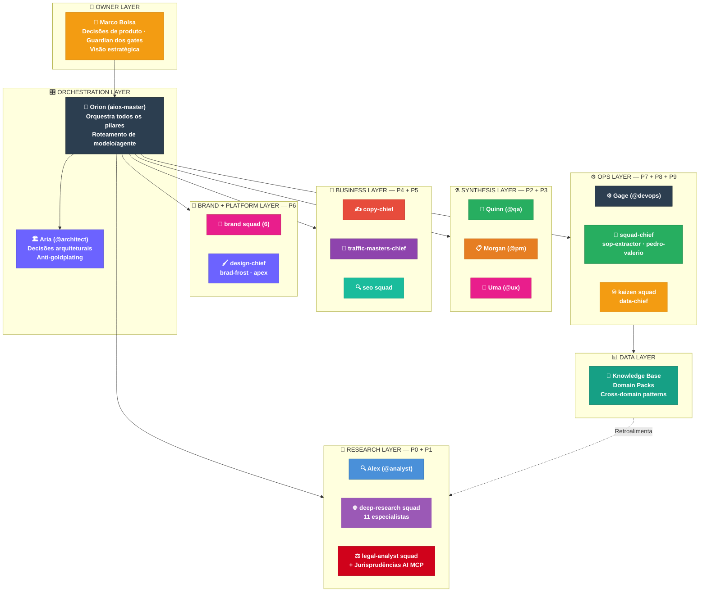
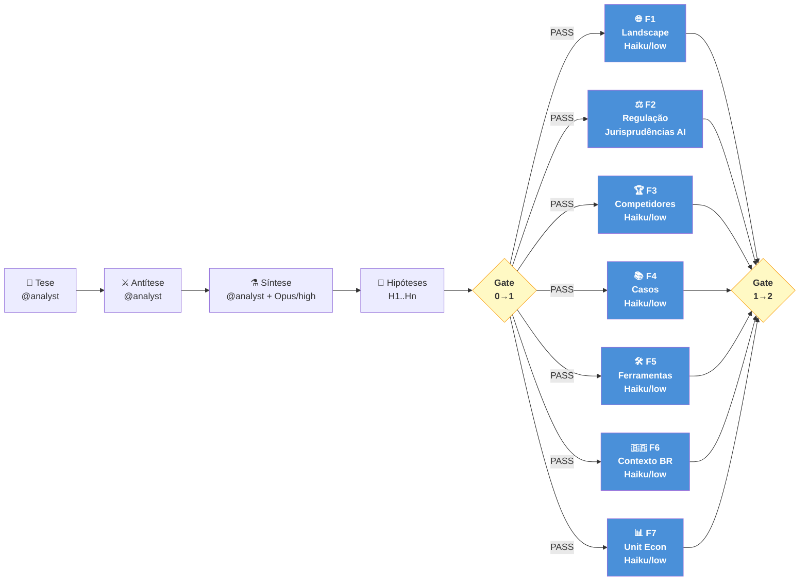
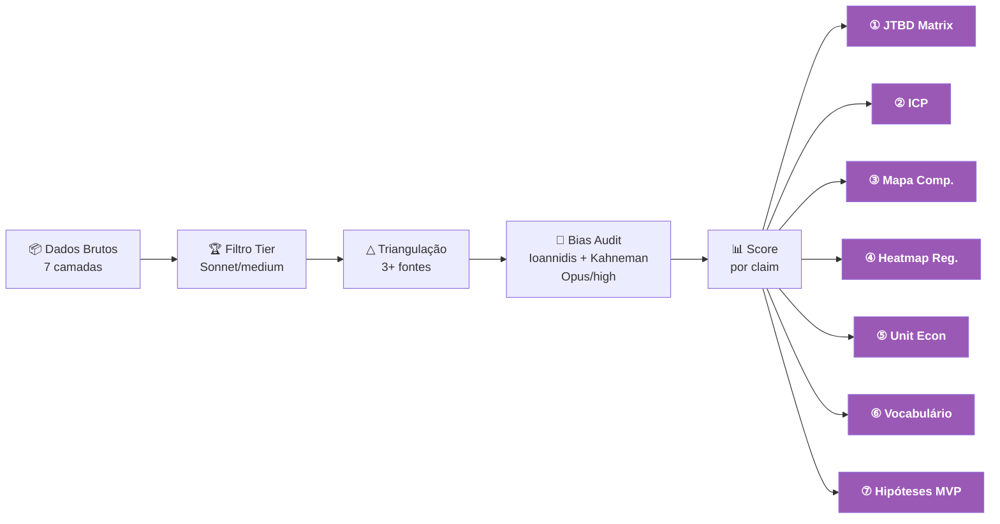
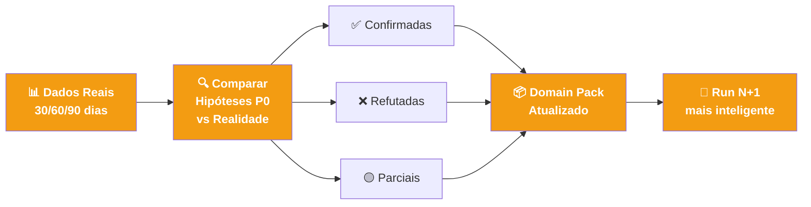
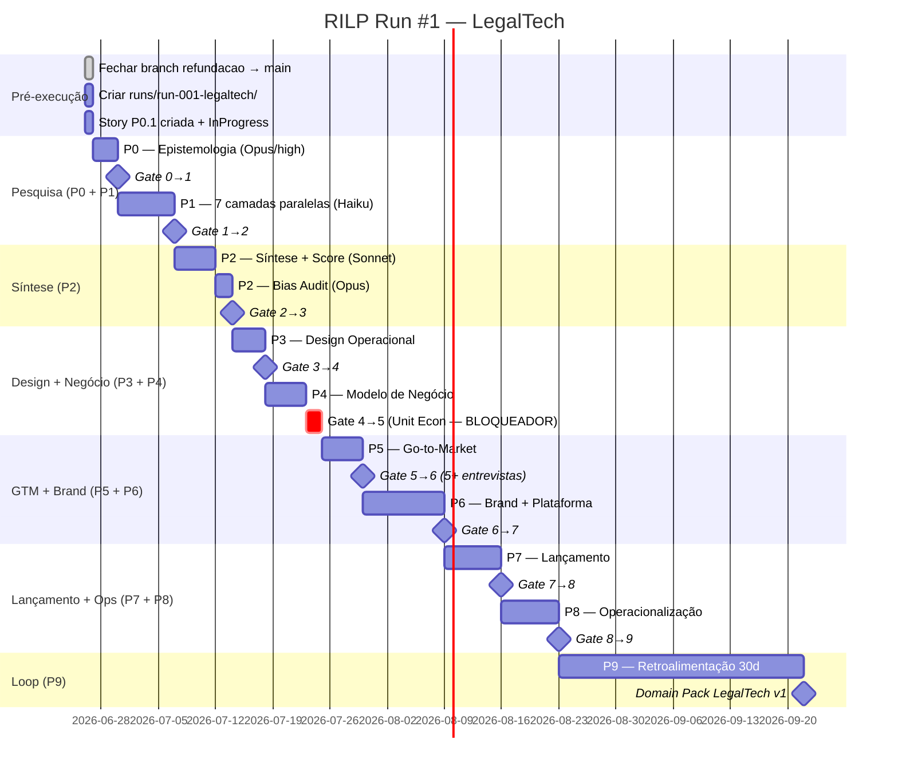
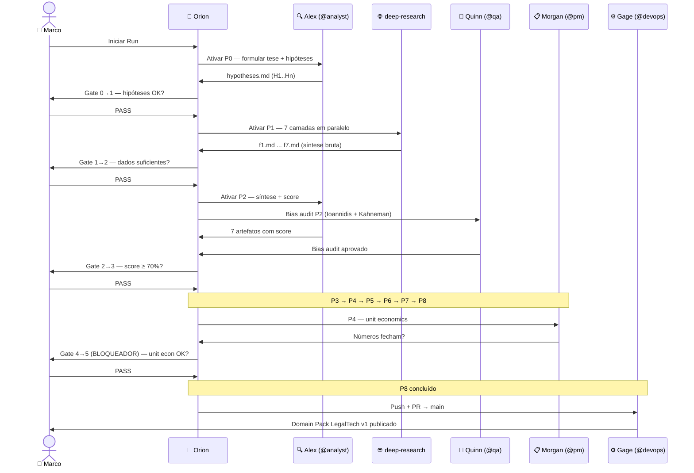
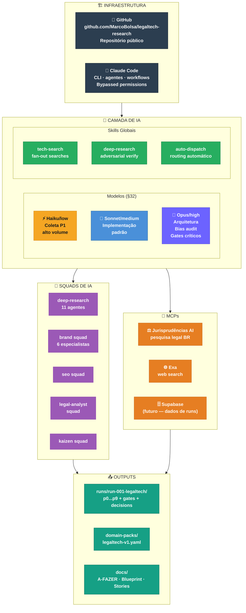
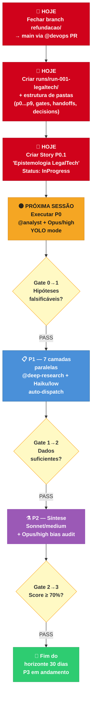

# OPERATIONAL BLUEPRINT — legaltech-research / RILP

> Espinha dorsal visual do projeto. Atualizado a cada story concluída e a cada encerramento de sessão.

**Projeto:** legaltech-research · RILP Run #1 — LegalTech
**Última atualização:** 2026-06-26
**Branch ativa:** refundacao/dedup-aiox-claude-md

---

## 1. Espinha Dorsal — Funil Completo do Sistema

```mermaid
flowchart TD
    START(["🎯 Domínio + Tese"]):::startend

    subgraph RESEARCH["🔬 FASE DE PESQUISA"]
        P0["📐 P0\nEpistemologia\nTese · Antítese · Hipóteses"]:::ep
        P1["🌍 P1\nInteligência de Mercado\n7 camadas paralelas"]:::pesq
    end

    subgraph SYNTHESIS["⚗️ SÍNTESE"]
        P2["🧬 P2\nSíntese Estratégica\n7 Artefatos + Score"]:::sint
    end

    subgraph BUILD["🏗️ CONSTRUÇÃO"]
        P3["🔧 P3\nDesign Operacional\nWorkflow T0→TN"]:::des
        P4["💰 P4\nModelo de Negócio\nUnit Economics"]:::neg
    end

    subgraph GOMARKET["📣 GO-TO-MARKET"]
        P5["📢 P5\nGTM\nCanais + Conteúdo"]:::gtm
        P6["🖌️ P6\nBrand + Plataforma\nIdentidade + UX"]:::brand
    end

    subgraph LAUNCH["🚀 LANÇAMENTO + OPS"]
        P7["🛫 P7\nLançamento\nPré · Day · 72h"]:::launch
        P8["🤖 P8\nOperacionalização\nSquads + SOPs + KPIs"]:::ops
    end

    subgraph LOOP["🔄 APRENDIZADO"]
        P9["🔁 P9\nLoop de Retroalimentação\nDados reais → Domain Pack"]:::loop
    end

    START --> P0
    P0 -->|"Gate 0→1"| P1
    P1 -->|"Gate 1→2"| P2
    P2 -->|"Gate 2→3\nScore ≥ 70%"| P3
    P3 -->|"Gate 3→4"| P4
    P4 -->|"Gate 4→5\n⚠️ UNIT ECON"| P5
    P5 -->|"Gate 5→6\n5+ entrevistas"| P6
    P6 -->|"Gate 6→7"| P7
    P7 -->|"Gate 7→8"| P8
    P8 -->|"Gate 8→9"| P9
    P9 -->|"Domain Pack\natualizado"| END(["✅ Business Blueprint A-Z"]):::startend
    P9 -.->|"Run N+1\nmais inteligente"| START

    classDef ep fill:#6C63FF,stroke:#5A52D5,color:#fff,font-weight:bold
    classDef pesq fill:#4A90D9,stroke:#2E6DA4,color:#fff,font-weight:bold
    classDef sint fill:#9B59B6,stroke:#8E44AD,color:#fff,font-weight:bold
    classDef des fill:#27AE60,stroke:#1E8449,color:#fff,font-weight:bold
    classDef neg fill:#E67E22,stroke:#CA6F1E,color:#fff,font-weight:bold
    classDef gtm fill:#E74C3C,stroke:#C0392B,color:#fff,font-weight:bold
    classDef brand fill:#E91E8C,stroke:#C2185B,color:#fff,font-weight:bold
    classDef launch fill:#1ABC9C,stroke:#17A589,color:#fff,font-weight:bold
    classDef ops fill:#2C3E50,stroke:#1A252F,color:#fff,font-weight:bold
    classDef loop fill:#F39C12,stroke:#D68910,color:#fff,font-weight:bold
    classDef startend fill:#2ECC71,stroke:#27AE60,color:#fff,font-weight:bold
```

---

## 2. Sistema Operacional — Camadas

---

## 3. Costelas — Workflows Internos por Sub-sistema

### costela:research — P0 + P1

### costela:synthesis — P2 + Score

### costela:brand — P6 Brand

### costela:loop — P9 Retroalimentação

---

## 4. Roadmap — Run #1 LegalTech

---

## 5. Fluxo de Aprovação — Handoffs entre Agentes

---

## 6. Stack Técnica

---

## 7. Status Atual

| Componente | Status | Notas |
|---|---|---|
| RILP-v2.md | ✅ Done | Documento principal criado 2026-06-26 |
| PROTOCOLO.md (v1) | ✅ Done | Referência histórica — v2 é o canônico |
| docs/OPERATIONAL-BLUEPRINT.md | ✅ Done | Este arquivo |
| docs/A-FAZER.md | 🟡 Em progresso | Template criado, seção ATACAR AGORA vazia |
| Branch refundacao/ | 🔴 Bloqueado | Precisa fechar → main antes de executar |
| runs/run-001-legaltech/ | 🔴 Bloqueado | Estrutura não criada |
| docs/stories/ P0.1 | 🔴 Bloqueado | Story não criada |
| P0 — Epistemologia | 🔒 Aguardando gate | Dependência: story P0.1 + branch mergeada |
| P1 — Inteligência | 🔒 Aguardando gate | Dependência: P0 PASS |
| P2 → P9 | 🔒 Aguardando gate | Dependência: pipeline sequencial |
| Domain Pack LegalTech | 🔒 Aguardando gate | Dependência: P9 completo |

---

## 8. Próximos 30 dias

---

*Blueprint atualizado em 2026-06-26 por Orion (aiox-master)*
*Fonte de verdade: https://github.com/MarcoBolsa/legaltech-research/blob/main/docs/OPERATIONAL-BLUEPRINT.md*
*(link ativo após merge da branch refundacao/ → main)*
